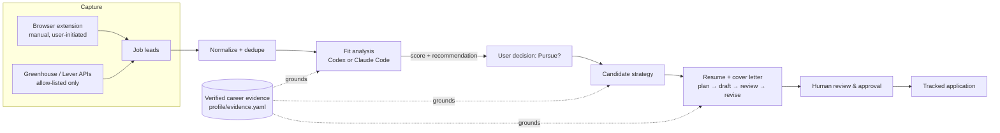

# AI Job Search Agent

A full-stack, evidence-grounded job-search platform: it discovers postings,
scores fit against a verified career record, drafts a tailored application
strategy, resume, and cover letter, and only submits after explicit human
review. Every generated claim traces back to a specific, verifiable piece of
career evidence — the system is built to make it structurally hard for an AI
step to invent or exaggerate something on your behalf.

Built solo, end to end: product requirements, workflow design, full-stack
implementation, and 180+ automated tests.


## Why this exists

Most "AI job application" tools optimize for volume — blast a resume at
hundreds of postings. This one optimizes for defensibility: every fact on a
generated resume or cover letter has to resolve to a specific piece of
evidence in a personal, structured career record, and nothing gets submitted
without a human looking at it first.

## Highlights

- **Evidence-grounded generation.** Every AI-authored resume bullet, cover
  letter claim, or interview talking point is validated against a library of
  verified career evidence (`profile/evidence.yaml`). Generation that
  references an evidence ID that doesn't exist fails validation and is
  rejected before it reaches the user.
- **Human-in-the-loop by design.** A SQLite-backed workflow state machine
  (`Discover → Analyze → Decide → Strategy → Draft → Review → Apply → Track`)
  gates every consequential step — salary commitments, submissions, and legal
  declarations always stop for explicit approval.
- **Safe capture mode.** The agent never automates LinkedIn, Indeed, or
  Eluta, never touches job-board credentials or sessions, and never bypasses
  rate limits or bot protection. Automatic collection is allow-listed to
  reviewed public ATS APIs (Greenhouse, Lever); everything else — including a
  companion Chrome extension — is manual, user-initiated capture.
- **Swappable AI providers.** Every generation step (analysis, strategy,
  resume, cover letter, review, revision) can run on Codex or Claude Code,
  selected per-run with no restart required — useful when one provider hits a
  usage limit mid-workflow.
- **17 structured AI skills, not one giant prompt.** Each pipeline stage
  (job-fit analysis, candidate strategy, resume planning/writing/review/
  revision, cover-letter planning/writing/review/revision, interview prep) is
  its own schema-validated skill under `hermes-skills/`, so a change to one
  step can't silently corrupt another.
- **112 backend scripts, 180+ automated tests.** Discovery, deduplication,
  capture-policy enforcement, workflow transitions, and document validation
  all have direct test coverage.

## How it works



- **Frontend:** React + TypeScript (`ui/`)
- **Backend:** Python `http.server` API, SQLite-backed workflow store, background workers
  for long-running AI steps (`scripts/`)
- **AI generation:** Codex CLI or Claude Code CLI, invoked per-step with strict JSON-schema
  output contracts
- **Document output:** PDF/DOCX generation for resumes and cover letters (ReportLab, python-docx)
- **Capture:** Manifest V3 Chrome extension for LinkedIn, Indeed, Eluta, and ZipRecruiter
  (`browser-extension/`)

## Screenshots

| Overview | Jobs workspace | Career profile |
|---|---|---|
|  |  |  |

*(See `docs/screenshots/README.md` for what to capture if these are placeholders.)*

## Product workflow

`Discover → Analyze → Decide → Build → Review and approve → Apply → Track`

The Python workflow lives in `scripts/` and the product interface lives in
`ui/`. Generated job, analysis, and application records remain separate from
the immutable career evidence library in `profile/`.

## Running it locally

Live career-profile YAML files are intentionally excluded from Git — this is
a personal tool, and the career data is private. After a fresh clone, create
private working copies from the sanitized templates:

```bash
python3 scripts/initialize_profile.py
```

This creates only missing files and never overwrites existing profile data.

Refresh the dashboard data from the repository root:

```bash
PYTHONPATH=scripts python3 scripts/export_dashboard_data.py
```

Then start the complete application with one command:

```bash
python3 scripts/run_app.py
```

Open `http://localhost:3000`. The launcher starts both the interface and its
persistent workflow service. Press `Ctrl+C` to stop both.

For development, the two services can still be started separately:

```bash
PYTHONPATH=scripts python3 scripts/workflow_api.py
cd ui && npm run dev
```

The Analyze action records an audited workflow run in `data/jobs.db`, starts
an ephemeral read-only analysis, and validates the resulting artifact before
it can mark the analysis complete. By default this runs on Codex.

To switch between Codex and Claude Code without restarting the app:

```bash
python3 scripts/set_analysis_provider.py claude   # or: codex
```

This writes `data/analysis_provider.txt`, which the workers read fresh on
every run — the change applies to the next click, no restart needed.
`JOB_ANALYSIS_PROVIDER` (env var) takes precedence over the file if set, and
`JOB_ANALYSIS_COMMAND` remains available as a full override for another
approved command that accepts a lead ID and prints the resulting artifact
path.

## Safe capture mode

Automatic collection is deny-by-default. The agent never automates LinkedIn,
Indeed, or Eluta and never uses job-board credentials, cookies, or browser
sessions. It currently collects complete postings only through reviewed public
Greenhouse and Lever APIs. Unknown or blocked sources stay in the manual capture
queue. Redirects must remain on the approved allowlist, and access controls or
rate limits are never bypassed.

When an imported alert contains a direct link for a configured Greenhouse or
Lever account, the posting enters a locked background safe-capture queue. One
worker processes eligible postings sequentially, archives only complete job
descriptions, and leaves failures visible for review or retry. Job-board links
never enter this worker.
