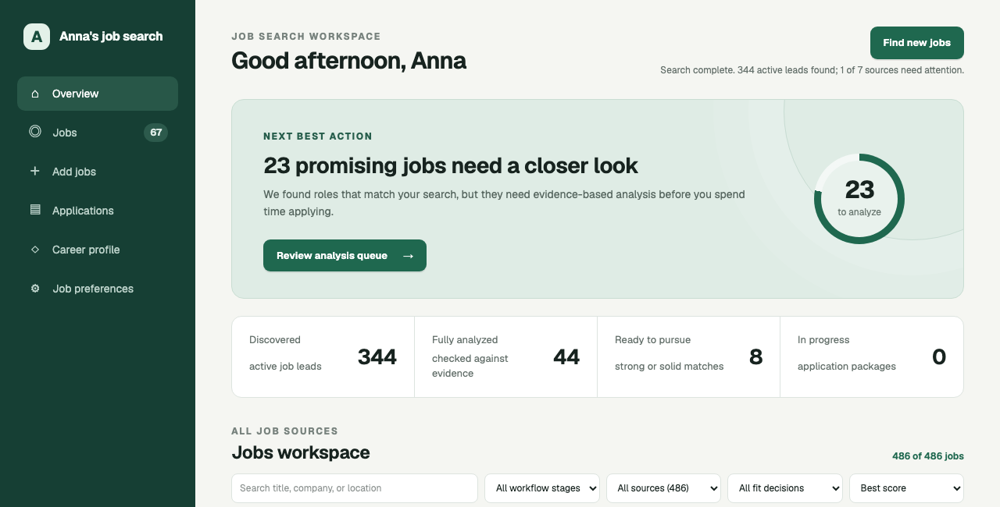
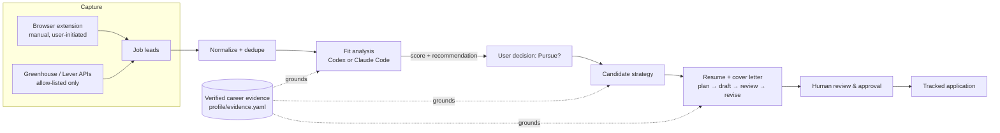
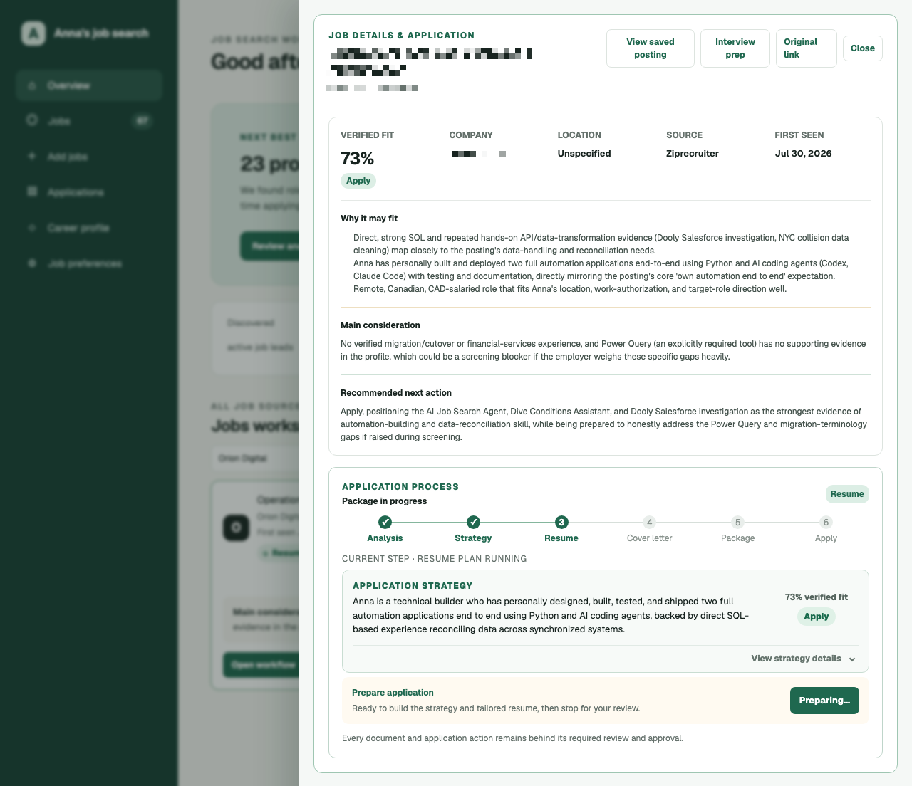
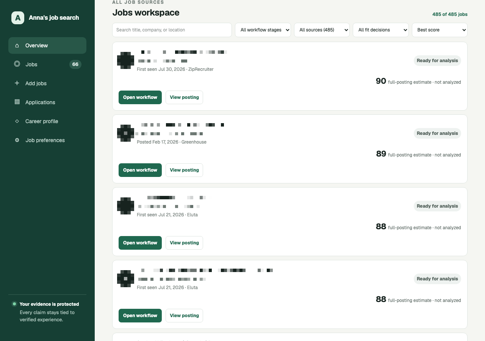
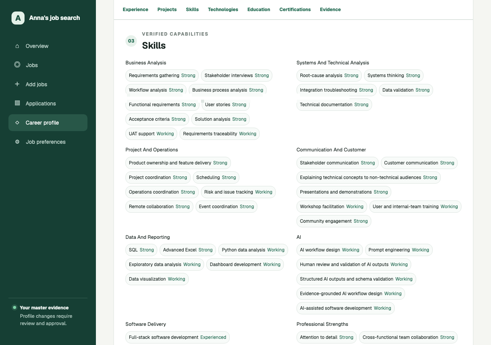

# AI Job Search Agent

An AI agent that runs my job search, end to end, on my own machine. It finds
postings, scores fit against a verified record of my actual work, and for
the ones worth pursuing, drafts a strategy, resume, and cover letter.
Nothing goes out without me reviewing it first.

The part I care about most is the evidence chain. Every resume bullet or
cover letter line has to trace back to something specific and true in a
structured record of my career. If a generation step tries to cite
something that isn't in that record, validation catches it before it ever
reaches me.

Built solo: the agent's skill design, the full-stack app, and 180+ tests.
Runs locally, no hosted backend, no data leaving my machine except the AI
provider calls themselves.



## Why it works this way

Most "AI job application" tools optimize for volume: generate a resume,
blast it at a few hundred postings. I wanted fewer applications and more
confidence in each one. Every claim on a generated document has to resolve
to a real piece of evidence, and a human looks at everything before it's
submitted.

## What it actually does

- Scores fit against a verified career record instead of matching keywords, with reasoning attached to the score.
- Runs a full pipeline for jobs worth pursuing: strategy, resume plan, draft, review, revision.
- Stops for explicit approval before anything consequential: salary numbers, submissions, legal declarations.
- Captures postings safely (see below), never by automating a job board directly.
- Runs each generation step on either Codex or Claude Code, switchable mid-workflow. Useful the moment one provider hits a usage limit.
- Splits the pipeline into 17 separate skills built on the Hermes skill format (`hermes-skills/`), instead of one long prompt, so a bad output in one step doesn't quietly corrupt the next one.

## How it works



Generated job, analysis, and application records stay separate from the
immutable career evidence library in `profile/`.

- **Frontend:** React + TypeScript (`ui/`)
- **Backend:** Python `http.server` API, SQLite-backed workflow store, background workers
  for long-running AI steps (`scripts/`)
- **AI agent:** Codex CLI or Claude Code CLI, invoked per-step with strict JSON-schema
  output contracts, running 17 Hermes-format skills (`hermes-skills/`)
- **Document output:** PDF/DOCX generation for resumes and cover letters (ReportLab, python-docx)
- **Capture:** Manifest V3 Chrome extension for LinkedIn, Indeed, Eluta, and ZipRecruiter
  (`browser-extension/`)

## Screenshots

Fit analysis, the generated application strategy, and the 6-stage pipeline
(Analysis → Strategy → Resume → Cover letter → Package → Apply), caught live
mid-run while the resume plan was generating in the background:



| Overview | Jobs workspace | Career profile |
|---|---|---|
|  |  |  |

*(See `docs/screenshots/README.md` for what to capture if these are placeholders.)*

## Running it locally

Everything runs on your machine: the UI, the API, the SQLite store, the
workers. The only network calls are to the AI provider CLI you pick (Codex
or Claude Code) and to allow-listed public ATS APIs during capture.

Live career-profile YAML files are intentionally excluded from Git. This is
a personal tool, and the career data is private. After a fresh clone, create
private working copies from the sanitized templates:

```bash
python3 scripts/initialize_profile.py
```

This creates only missing files and never overwrites existing profile data.

Refresh the dashboard data from the repository root:

```bash
PYTHONPATH=scripts python3 scripts/export_dashboard_data.py
```

Then start the complete application with one command:

```bash
python3 scripts/run_app.py
```

Open `http://localhost:3000`. The launcher starts both the interface and its
persistent workflow service. Press `Ctrl+C` to stop both.

For development, the two services can still be started separately:

```bash
PYTHONPATH=scripts python3 scripts/workflow_api.py
cd ui && npm run dev
```

The Analyze action records an audited workflow run in `data/jobs.db`, starts
an ephemeral read-only analysis, and validates the resulting artifact before
it can mark the analysis complete. By default this runs on Codex.

To switch between Codex and Claude Code without restarting the app:

```bash
python3 scripts/set_analysis_provider.py claude   # or: codex
```

This writes `data/analysis_provider.txt`, which the workers read fresh on
every run. The change applies to the next click, no restart needed.
`JOB_ANALYSIS_PROVIDER` (env var) takes precedence over the file if set, and
`JOB_ANALYSIS_COMMAND` remains available as a full override for another
approved command that accepts a lead ID and prints the resulting artifact
path.

## Safe capture mode

Automatic collection is deny-by-default. The agent never automates LinkedIn,
Indeed, or Eluta and never uses job-board credentials, cookies, or browser
sessions. It currently collects complete postings only through reviewed public
Greenhouse and Lever APIs. Unknown or blocked sources stay in the manual capture
queue. Redirects must remain on the approved allowlist, and access controls or
rate limits are never bypassed.

When an imported alert contains a direct link for a configured Greenhouse or
Lever account, the posting enters a locked background safe-capture queue. One
worker processes eligible postings sequentially, archives only complete job
descriptions, and leaves failures visible for review or retry. Job-board links
never enter this worker.
